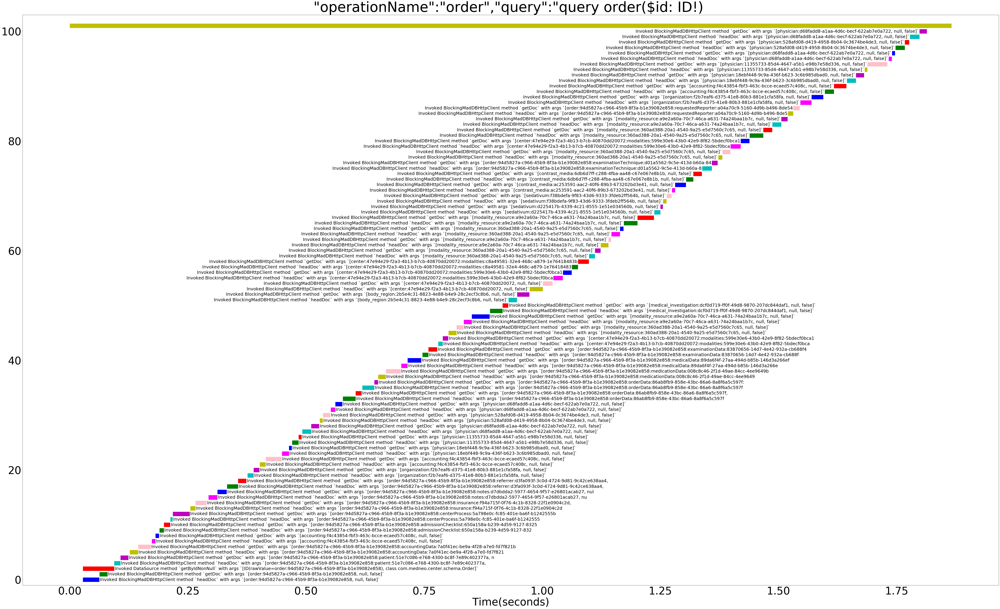

# trace-json-plotter
A small jupyter notebook to draw timelines for the sequential or parallel calls to numerous methods.

## Input
Json file input is structured to contain `start` and `end` timestamps, along with a simple text message as info to be labeled on plot.
Here in the sample files, I have used `start`, `end`, `info` keys respectively.

## Output
The notebook will give out a call timeline plot similar to what is seen over network tab of your browser.

